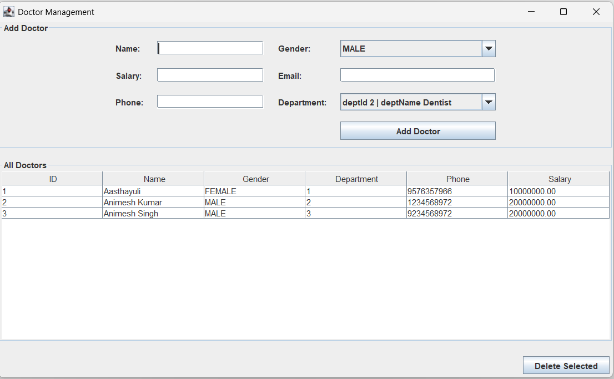
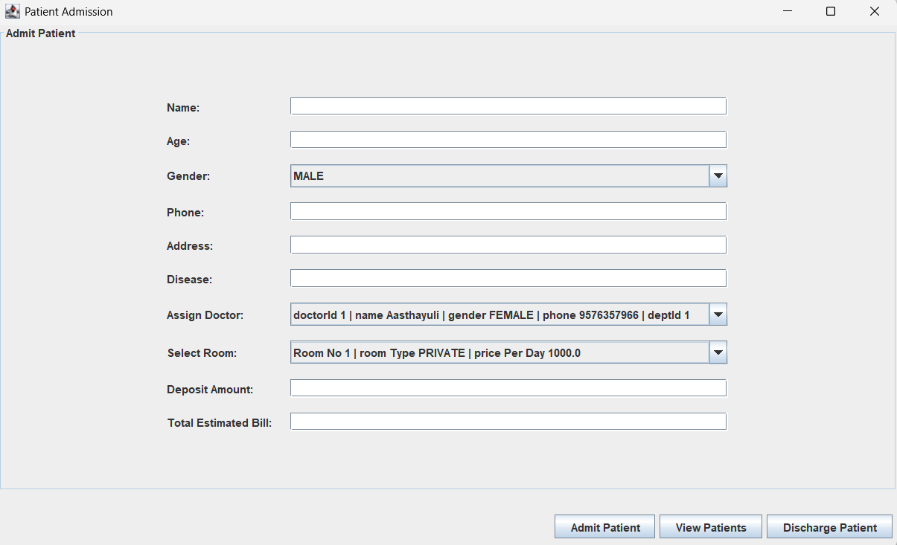
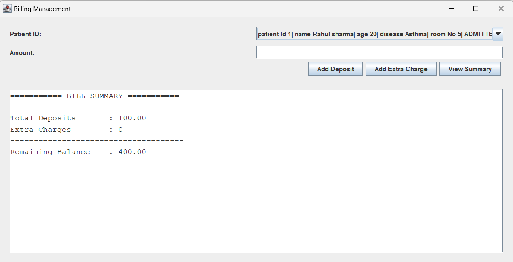

# 🏥 Hospital Management System (Java Swing + JDBC)

A desktop-based Hospital Management System built using **Java (Swing for UI)** and **JDBC for database connectivity**.  
This project manages core hospital operations including Role based login, patient admission, discharge, billing, user management, ambulance tracking, and room allocation.

---

## 🚀 Features

### 👤 User Management

- Add new users (Admin / Doctor / Receptionist)
- Delete users
- View all users
- Role-based structure

### 🩺 Patient Management

- Admit patient with doctor and room assignment
- View patient details
- View admitted patients
- Discharge patient with validation

### 🏨 Room Management

- Assign available rooms
- Auto-update room status on admission/discharge

### 💰 Billing System

- Add deposits
- Add charges
- View billing summary
- Calculate balance dynamically

### 🚑 Ambulance Management

- Add ambulance details
- Track availability
- Delete ambulance
- View all ambulances

---

## 🛠 Tech Stack

- **Java**
- **Java Swing (GUI)**
- **JDBC**
- **MySQL (or compatible relational database)**
- **BigDecimal for financial precision**
- **DAO + Service Layer Architecture**

---

## Watch Video

[Working Demo](https://drive.google.com/file/d/1A5c9YjU0tJTsZ49Mhgpp5A2nVkqJYCtd/view?usp=sharing)

## Screenshots

#### Doctor Management

---

## 🧠 Architecture

The project follows a **3-layer architecture**:

1. **UI Layer (Swing)**
   - Handles user interaction
   - Displays tables, forms, dialogs

2. **Service Layer**
   - Contains business logic
   - Validates operations
   - Coordinates DAO calls

3. **DAO Layer**
   - Handles database operations
   - Uses JDBC for CRUD operations

---

## 🗄 Database Requirements

You need a relational database with tables such as:

- users
- patients
- doctors
- rooms
- ambulances
- billing / transactions

Update your database credentials inside the connection configuration file.

---

## ▶ How to Run

1. Clone the repository
2. Configure your database (Example SQL Script file is given)
3. Update JDBC credentials (Create db.properties file given)
4. Compile project
5. Run LoginUI.java

## 👨‍💻 Author

Aasthayuli

Final Year B.tech Computer Science Student
